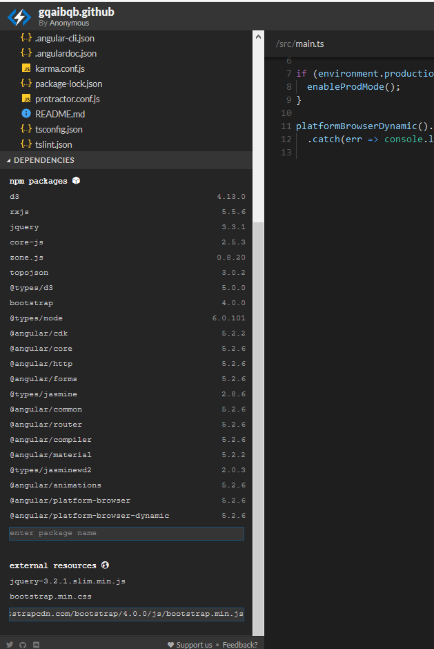

# Projekt im Modul Programmieren von Benutzeroberflächen
Das Ziel des Projektes ist es eine JSON Datei, welche Prozesse zu verschiedenen Projekten enthält zu visualisieren. 
Es besteht die Möglichkeit nach Daten zu filtern, nach Daten zu sortieren (bei Klick auf die Tabellenüberschriften) und Daten zu suchen. 
Bei Klick auf eine Tabellenzeile in der Prozesstabelle, werden Details zu einem Prozess in einer Timeline angezeigt.  
*Verwendende Frameworks:* Bootstrap, Angular5, D3.js 
Die gesamte Applikation ist responsive.

*Entwickler:* Fabian Meyertöns (s74004), Florian Fricke (s74003) (Studiengang: Wirtschaftsinformatik)

Die App kann lokal getestet werden durch
- Klonen des Repositories
- Wechseln in den Ordner in der Kommandozeile
- npm install -g @angular/cli
- npm install
- ng serve --open

alternativ: 
**Link zum testen der Applikation:** https://stackblitz.com/github/florianfricke/PBO_Project 
Damit die Seitennavigation ein- und aufklappbar ist, müssen links unter "DEPENDENCIES" -> "external resources" noch folgende drei Bibliotheken verlinkt werden. (in dieser Reihenfolge; jeweils den Link mit Enter hinzufügen) 
https://code.jquery.com/jquery-3.2.1.slim.min.js 
https://maxcdn.bootstrapcdn.com/bootstrap/4.0.0/css/bootstrap.min.css 
https://maxcdn.bootstrapcdn.com/bootstrap/4.0.0/js/bootstrap.min.js 

